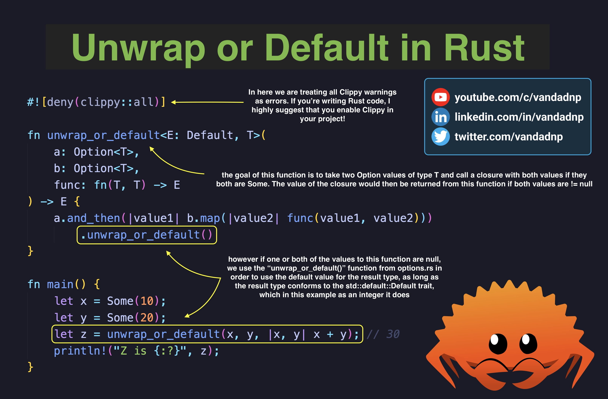
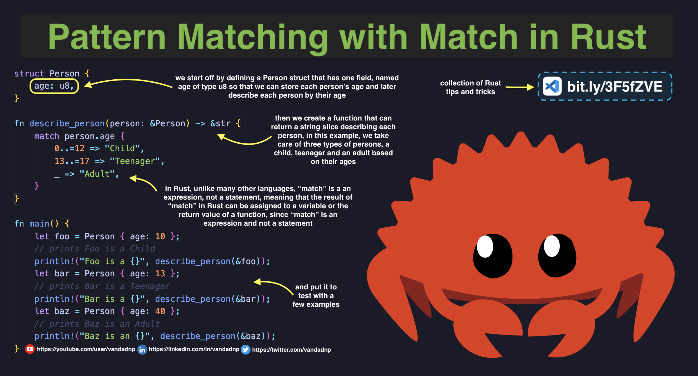
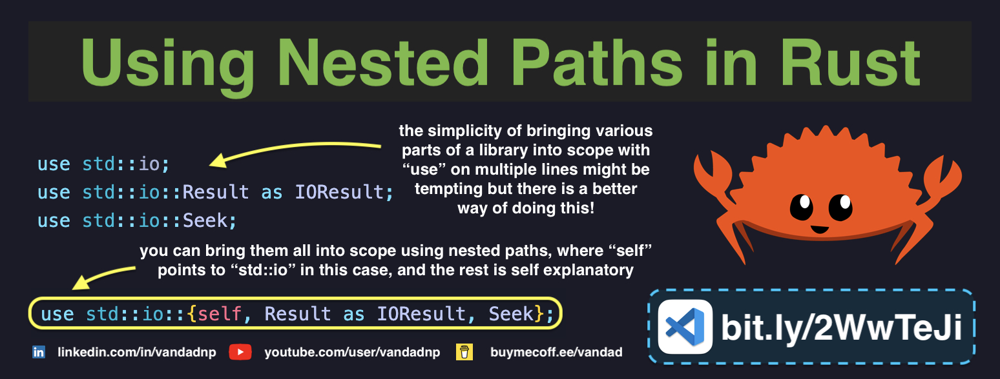
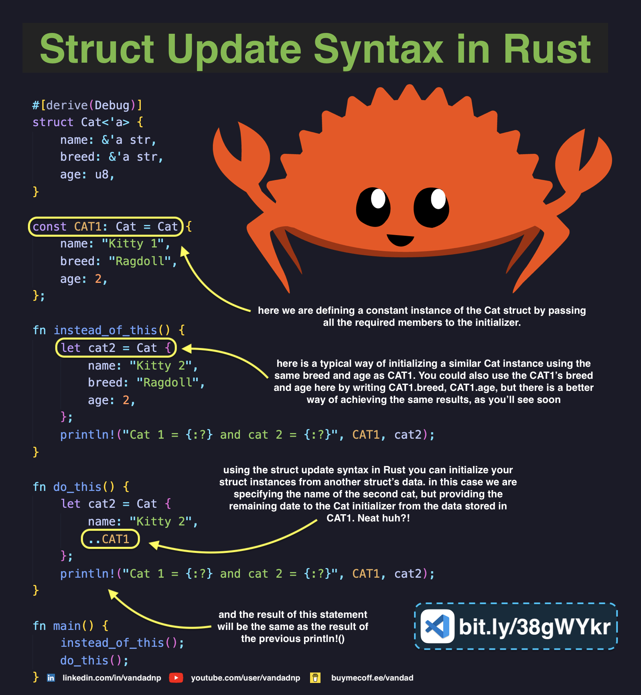
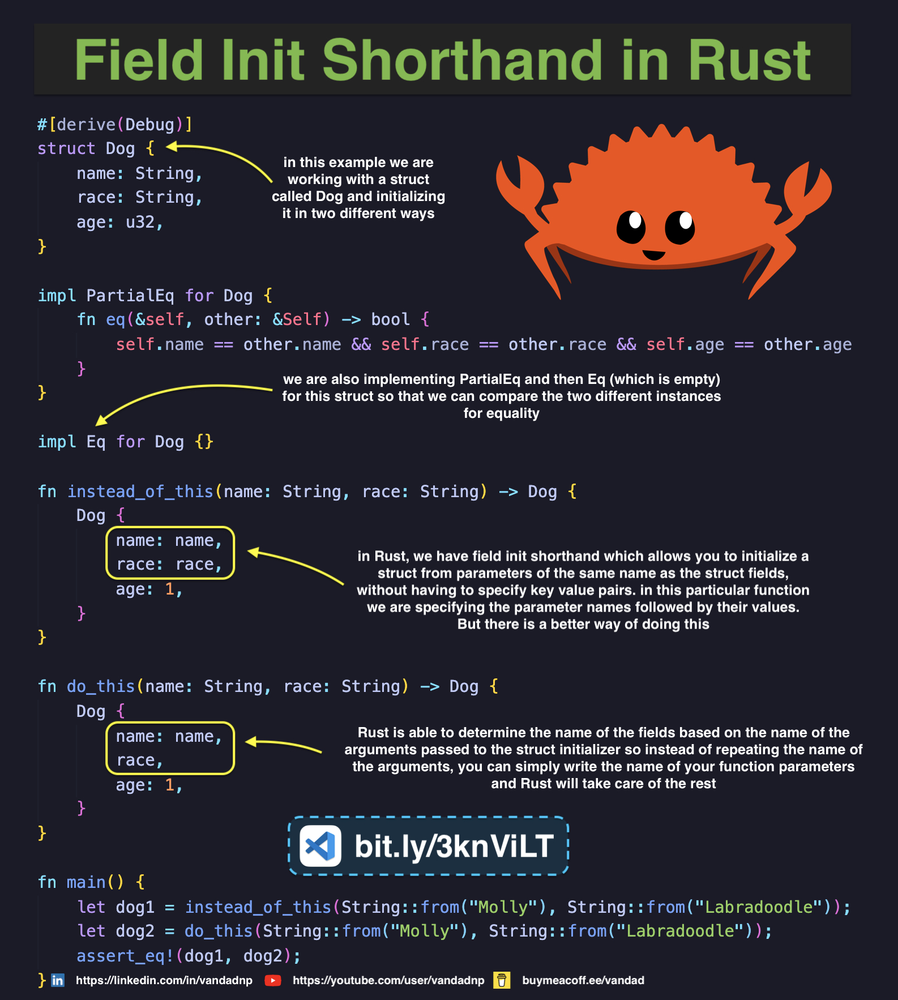

# Table of Contents

* [Unwrap or Default in Rust](#unwrap-or-default-in-rust)
* [Drop Trait in Rust](#drop-trait-in-rust)
* [HashMap Literals in Rust](#hashmap-literals-in-rust)
* [Parsing JSON in Rust](#parsing-json-in-rust)
* [Pattern Matching with Match in Rust](#pattern-matching-with-match-in-rust)
* [Using Nested Paths in Rust](#using-nested-paths-in-rust)
* [Struct Update Syntax in Rust](#struct-update-syntax-in-rust)
* [Field Init Shorthand in Rust](#field-init-shorthand-in-rust)
* [Shadowing in Rust](#shadowing-in-rust)

# Unwrap or Default in Rust

[Source Code](source/unwrap-or-default-in-rust.rs)

# Drop Trait in Rust

[Source Code](source/drop-trait-in-rust.rs)

# `HashMap` Literals in Rust

[Source Code](source/hashmap-literals-in-rust.rs)

# Parsing JSON in Rust

[Source Code](source/parsing-json-in-rust.rs)

# Pattern Matching with Match in Rust

[Source Code](source/pattern-matching-with-match-in-rust.rs)

# Using Nested Paths in Rust

[Source Code](source/using-nested-paths-in-rust.rs)

# Struct Update Syntax in Rust

[Source Code](source/struct-update-syntax-in-rust.rs)

# Field Init Shorthand in Rust

[Source Code](source/field-init-shorthand-in-rust.rs)

# Shadowing in Rust

[Source Code](source/shadowing-in-rust.rs)

